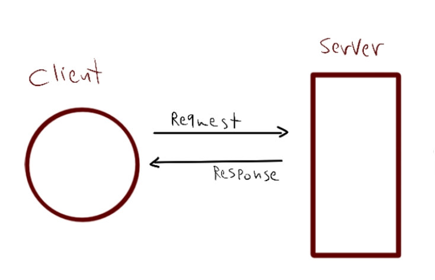

# Lab 01
## server-deployment-practice
Author: Sham Al-Jalam

* deployed application : [https://server-deployment-practice-oo7v.onrender.com/](https://server-deployment-practice-oo7v.onrender.com/)
[Link text](link URL)


* Github actions: [https://github.com/ShamAhmad2022/server-deployment-practice/actions](https://github.com/ShamAhmad2022/server-deployment-practice/actions)

*  pull request: [https://github.com/ShamAhmad2022/server-deployment-practice/pull/2](https://github.com/ShamAhmad2022/server-deployment-practice/pull/2)

### Setup:
.env requirements:

PORT - Port Number

### Running the app:
* npm start

* Endpoint: /

    * Returns Object
    ```Js
    {
        "code": 200,
        "message": "Welcome to the Home page :)",
        "time": "2023-06-12T18:14:37.692Z"
    }
    ```

* server errors

    * Returns Object
    ```Js
    {
        "code": 500,
        "route": "/error",
        "query": {},
        "body": {
            "test": "test"
        },
        "message": "Server error: message is not defined"
    }
    ```

* not found pages:

    * Returns Object
    ```Js
    {
        "code": 404,
        "message": "Page Not Found!",
        "route": "/sasd"
    }
    ```
### Test:
* Unit Test: npm test

### WRRC
